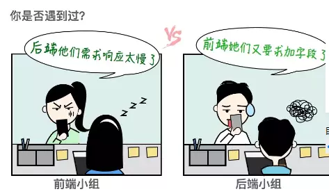
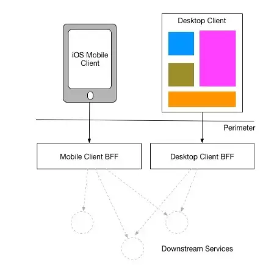

## 认知BFF层

### BFF的诞生背景

近几年，在企业开发中越来越推崇微服务架构，而微服务架构在落地过程中不经意的导致了一个问题，即前端同学和后端同学之前关于api接口颗粒度的争吵，越来越多见
* 「你自己请求 2 个接口再组装不就行了？」 - 后端同学追求服务下沉和解耦
* 「少一次 HTTP 啊，加一个接口有那么难么？」 - 前端同学离用户最近，需要考虑用户体验灵活性

归根结底为一个问题：服务设计的接口究竟是面向UI还是只是通用服务

上面这张图在笔者在永辉从事iOS客户端工作的时候经常遇到，当时特别费解：
* 为什么在首页加个用户状态相关字段这么麻烦，神马，你要直接加一个接口，要不要这么夸张... 
* 你加了之后我的前端的异步流程控制的代码怎么写，单个接口错误处理怎么关联前端交互...

#### 前端痛点

* 站在前端的角度，面向通用服务的接口很难满足前端交互需求
* 像OC这样对异步编程支持很简陋的语言，丑陋的异步流程控制代码给代码的维护带来了巨大挑战，也会间接导致各种神奇的bug

这也是笔者为什么想尝试下coobjc(阿里开源的支持OC的coroutine框架)，**框架一定是为了解决实际业务开发中的痛点，而不仅仅是为了炫技**

#### BFF的提出

2015 年，Sam Newman 对此提出了 Pattern: Backends For Frontends，简称 BFF，国内也俗称为粘合层。

可以看出，这一层一直都存在，只不过是由后端同学维护而已。但我们知道，前端贴近用户侧，需求的变化太快了，后端同学来维护会很累。在 BFF 理念中，最重要的一点是：服务自治，谁使用谁开发，即它应该由前端同学去维护。

服务自治减少了沟通成本，带来了灵活和高效。

#### BFF的实现，为什么选择Node.js

* BFF 并不限制具体技术，团队根据自己的技术栈来选型： Java/Node/PHP/Python/Ruby...
* 基于 GraphQL 技术的通用中间层网关，也是刚刚出现一种很不错的方案。
* 在大部分前端团队中，都会倾向于选择生态更优，语法更熟悉的 Node.js 。

所以总结下来，无它，就是需要这样的一个中间层，但后端同学不太想管了（也管不过来），所以大部分前端同学选择了一个更顺手的 Node.js ，仅此而已。

### 什么是BFF

### BFF为了解决什么问题

### 使用BFF的正确姿势

### BFF实战

#### 参考

[什么是中间件？](https://www.jianshu.com/p/1d82f0b050e2)