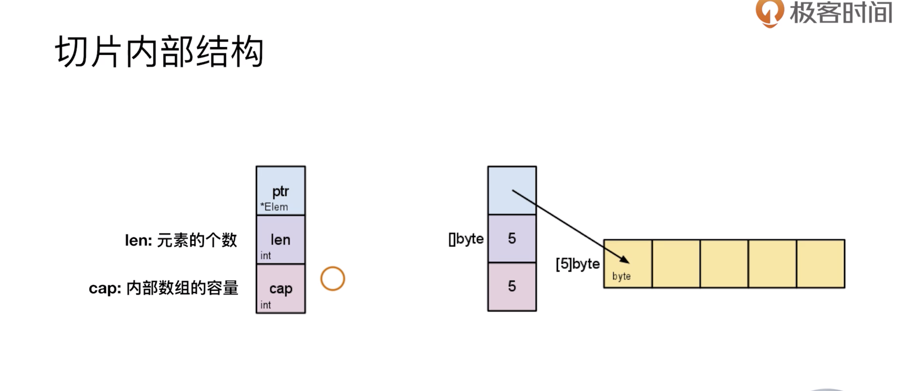
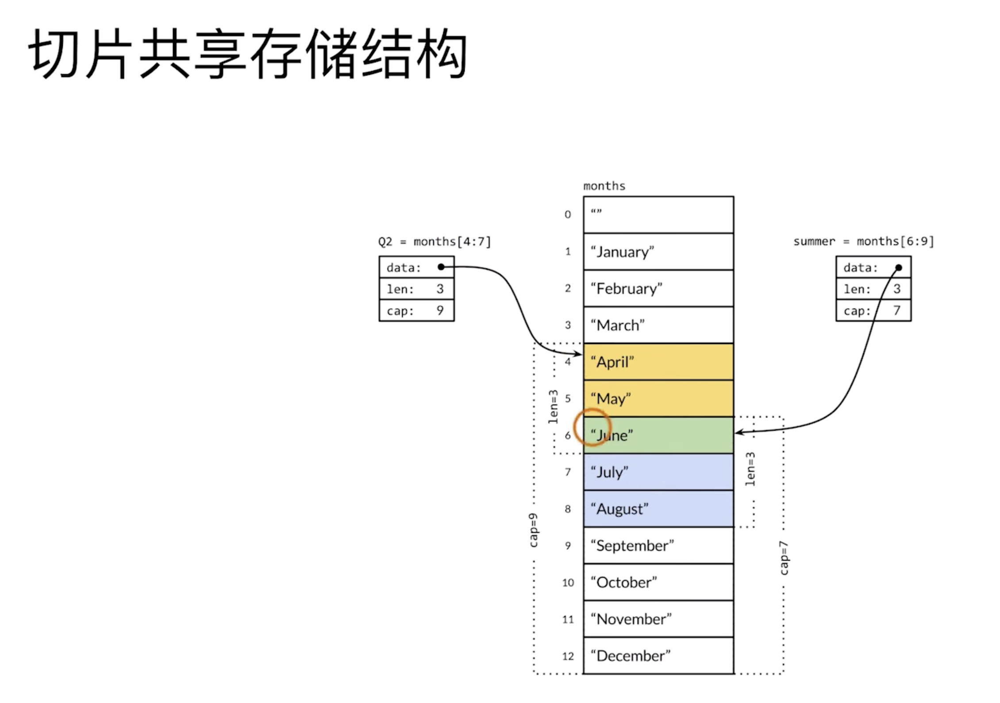

go1.8版本之后如果没有GOPATH使用默认

## 第一个go程序

### 应用程序入口
* 必须是 main 包: package main(目录可以不是main)
* 必须是 main 方法: func main() {}
* 文件名不一定是 main.go

### 应用程序返回值
``` go
os.Exit(0)
```

### 应用程序的入参
```
os.Args[]
```

## 变量、常量与其他语言的差异

### 编写测试程序（类似于JUnit, 这里为了方便学习代码测试）
1. 源码文件以 _test 结尾： xxx_test.go
2. 测试方法名以 Test 开头： func TestXXX(t *testing.T) {...}

注意：
* go test -v xxx_test.go 才能输出 t.Log 里的文字
* 如果你使用的是 vs code 编辑器的话，安装好了go的相关配置，会在测试文件中看到 ` run test | debug test `的提示，你点击 `run test` 之后在下面看不到 `t.Log()` 输出的内容就请把 `"go.testFlags": ["-v"],` 这行代码加入到你的 settings.json 文件中（设置 Workspace Settings。打开 .vscode/settings.json）

### 变量的赋值

``` go
// 第一种写法
var a int = 1
var b int = 2
// 第二种写法
var (
  a int = 1
  b int = 2
)
// 第三种写法(自动类型推断)
a := 1
b := 2
```
go推崇简单的代码方式，选择一种就好了，第三种最简洁（但是会不会和swift一样有性能问题）

变量赋值与其他编程语言的区别
* 赋值可以进行自动类型判断
* 在一个赋值语句中可以对多个变量同时赋值

``` go
a, b = b, a
```

### 常量与其他编程语言的差异
* 快速设置连续值
``` go
const( 
  Monday = iota + 1
  Tuesday
  Wednesday
)

const (
  Readable = 1 << iota
  Writable
  Executable
)
```

## 数据类型

### 与其他编程语言的差异：
* Go语言不允许隐式类型转换（c/c++允许小类型向大的隐式转换）
* 别名和原有类型也不能进行隐式类型转换

``` go
package type_test

import "testing"

type MyInt = int64
func TestImplicit(t *testing.T)  {
	// var a int = 1
	var a int32 = 1
	var b int64
	// b = a
	b = int64(a)
	var c MyInt
	// c = b
	c = MyInt(b)
	t.Log(a, b, c)
}
```

### 预定义值在Math模块

### go的内存
go内存是垃圾回收的，但是为了高效，与支持指针

* 支持指针，但是不支持指针运算
* string是值类型，其默认的初始化值是空字符串

``` go
func TestPoint(t *testing.T)  {
	a := 1
	aPtr := &a
	// aPtr += 1
	t.Log(a, aPtr)
	t.Logf("%T %T", a, aPtr)
}

func TestString(t *testing.T)  {
	var s string
	t.Log("*" + s + "*")
	t.Log(len(s))
}
```

## 运算符

### 算数运算符

* 禁止了前置++，--自增自减的运算
* 用 == 比较数组
  * 相同维数且相同个数元素的数组才可以比较
  * 两个数组的元素都相等才相等

``` go
func TestCompareArray(t *testing.T)  {
	a := [...]int{1, 2, 3, 4}
	b := [...]int{1, 3, 4, 5}
	// c := [...]int{1, 2, 3, 4, 5}
	d := [...]int{1, 2, 3, 4}

	t.Log(a == b)
	t.Log(a == d)
}
```

### 位运算符
&^ 按位清零

``` go
1 &^ 0 -- 1
1 &^ 1 -- 0
0 &^ 1 -- 0
0 &^ 0 -- 0
// 右边为0，左边值，右边为1，左边置为0
```

``` go
// 按位清零
const(
	Readable = 1 << iota
	Writable
	Executable
)

func TestBitClear {
	a := Readable
	a &^ Readable
	a &^ Executable
	t.Log(a&Readable == Readable, a&Writable == Writable, a&Executable == Executable)
}
```

## 循环和条件

### 循环
只支持for循环
``` go
n := 1
for n < 5 {
	t.Log(n)
	n++
}
```

### if条件
与其他主要编程语言的差异
1. condition 表达式结果必须为布尔值
2. 支持变量赋值（和swift一样）
``` go
if var declaration; condition {
	
}
// go的常用用法，类似于tuple
func TestIfMultiSet(t *testing.T)  {
	if v, err = foo(); err == nil {
		t.Log("1 == 1")
	} else {
		t.Log("1 != 1")
	}
}
```

### switch条件
* 默认有break 
* 单个case后面有多个元素

``` go
package condition

import "testing"

// func TestIfMultiSet(t *testing.T)  {
// 	if v, err = foo(); err == nil {
// 		t.Log("1 == 1")
// 	} else {
// 		t.Log("1 != 1")
// 	}
// }

func TestSwitchMultiCase(t *testing.T) {
	for i := 0; i < 5; i++ {
		// switch i {
		// 	case 0, 2: 
		// 		t.Log("Even")
		// 	case 1, 3, 5:
		// 		t.Log("Odd")
		// 	default:
		// 		t.Log("unknown")
		// }
		/
		// 注意下面的i
		switch {
			case i%2 == 1:
				t.Log("Even")
			case i%2 == 0:
				t.Log("Odd")
			default: 
				t.Log("unknown")
		}
	}
}
```

## 数组和切片

### 数组的声明

``` go
var a [3]int
a[0] = 1

b := [3]int{1, 2, 3}
c := [2][2]int{{1, 2}, {3, 4}}

d := [...]int{1, 2, 3, 4, 5}
```

### slice
slice 用起来可以简单的看做是可变数组，实际是go的结构体


* ptr 指向连续的内存空间，指向数组
* len 元素个数
* cap 内部数组的容量

=> 代码理解len和cap的区别

``` go
s := []int{} 
```

#### slice的增长
``` go
func TestSliceGrowing(t *testing.T)  {
	s := []int{}
	for i := 0; i < 10; i++ {
		s = append(s, i)
		t.Log(len(s), cap(s))
	}
}
/Users/silence/go_learing/src/ch6/slice_test/slice_test.go:29: 1 1
/Users/silence/go_learing/src/ch6/slice_test/slice_test.go:29: 2 2
/Users/silence/go_learing/src/ch6/slice_test/slice_test.go:29: 3 4
/Users/silence/go_learing/src/ch6/slice_test/slice_test.go:29: 4 4
/Users/silence/go_learing/src/ch6/slice_test/slice_test.go:29: 5 8
/Users/silence/go_learing/src/ch6/slice_test/slice_test.go:29: 6 8
/Users/silence/go_learing/src/ch6/slice_test/slice_test.go:29: 7 8
/Users/silence/go_learing/src/ch6/slice_test/slice_test.go:29: 8 8
```
s = append(s, 1): cap的变化显示结构体指向的连续存储空间增长时，是创建新的一片连续空间(地址发生了变化)，所以需要拷贝赋值，会影响性能


* 多个slice共享存储空间（通过指针寻找数据内存地址）
* 修改一个，内存中的数据改变，都是一起改变的
``` go
func TestSliceShareMemory(t *testing.T) {
	year := []string{"Jan", "Feb", "Mar", "Apr", "May", "Jun", "Jul", "Aug", "Sep", "Oct", "Nov", "Dec"}
	Q2 := year[3:6]
	t.Log(Q2, len(Q2), cap(Q2))
	summer := year[5:8]
	t.Log(summer, len(summer), cap(summer))
	summer[0] = "Unknown"
	t.Log(Q2)
	t.Log(year)
}
/Users/silence/go_learing/src/ch6/slice_test/slice_test.go:36: [Apr May Jun] 3 9
// 为什么是cap是9，从截取的Apr开始后面是9个，cap指向的是后面连续的存储空间
Users/silence/go_learing/src/ch6/slice_test/slice_test.go:38: [Jun Jul Aug] 3 7
/Users/silence/go_learing/src/ch6/slice_test/slice_test.go:40: [Apr May Unknown]
/Users/silence/go_learing/src/ch6/slice_test/slice_test.go:41: [Jan Feb Mar Apr May Unknown Jul Aug Sep Oct Nov Dec]
```

### 数组和切片的区别
1. 容量是否可伸缩（数组不可变，切片可变）
2. 是否可以进行比较（切片不可比较，只能和nil比较）

## Map

### Map的声明
``` go
m1 := map[string]int{"one": 1, "two": 2, "three": 3}
m2 := map[string]int{}
m2["one"] = 1
和 slice 的内存方式是一样的，是共享内存的方式
m3 := make(map[string]int, 10 /*Initial Capacity*/)
```

### Map的key-value
* 和主流语言不一样，m[key] 取value的时候如果key不存在，返回0而不是nil， 这样是无法判断是key不存在还是value真的是0

``` go
// go 的解决方法
if v, ok := m1[3]; ok {
	t.Log("Key 3's value is %d", v)
} else {
	t.Log("Key 3 is not existing.")
}
```

### map的遍历
``` go
m := map[int]int{1: 1, 2: 4, 3: 8}
for k,v range m {
	t.Log(k,v)
}
```

### map实现工厂模式（value为func，func在go里面是一等公民）
``` go
m := map[int]func(op int) int{}
m1 = func(op int) int{ return op }
m2 = func(op int) int{ return op * op}
```

### 实现Set map[type]bool
```go
func TestMapForSet(t *testing.T) {
	mySet := map[int]bool{}
	mySet[1] = true
	n := 1
	// n := 3
	if mySet[n] {
		t.Log("1 is existing")
	} else {
		t.Logf("%d is not existing", n)
	}
	mySet[3] = true
	t.Log(len(mySet))

	delete(mySet, 1)
	n = 1
	if mySet[n] {
		t.Log("1 is existing")
	} else {
		t.Logf("%d is not existing", n)
	}
}
```

## Func

### Func
* go中的函数是一等公民
* go函数可以接受多个传参
* defer延时函数

``` go
func returnMultiValues() (int, int) {
	return rand.Intn(10), rand.Intn(20)
}
```

## 面向对象

### 行为的定义和实现

#### go的对象的声明
``` go
// 结构体(对象，类似OC的对象就是结构体指针)
type Employee struct {
	ID:  	string
	Name: string
	Age:	int
}

func TestCreateObj(t *testing.T) {
	e := Employee{"0", "Bob", 20}
	e1 := Employee{Name: "Mike", Age: 30}
	e2 := new(Employee)
	e2.ID = "2"
	e2.Age = 22
	e2.Name = "Rose"
}
```

1. new(Employee)返回的是指针类型
2. go中访问指针的成员不需要->, 点语法可以直接访问


