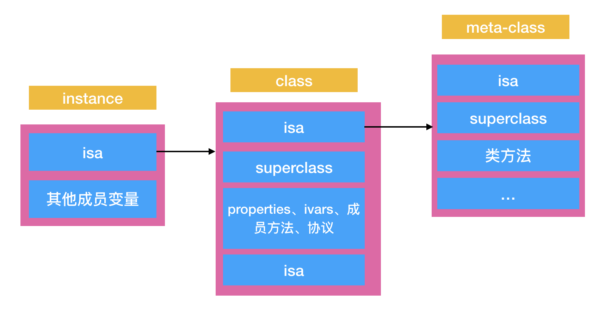

## 1. runtime

### 1.1 什么是runtime：我理解的runtime
OC是动态性的语言，所以不仅需要一个编译器，也需要一个运行时系统（liba 动态库）来动态创建类和对象，进行消息转发和传递
首先解释下编译时和运行时
编译时: compiler 将高级语言编译为机器可执行的机器码，llvm的编译过程有点意思的
运行时: 分配内存（创建对象）和 方法调用(objc_msgSend的消息机制)
runtime是一组c/c++/汇编编写的运行时库（系统），负责运行在运行时执行oc代码(~~OC是C的超集，OC对象的本质是C的结构体指针，OC方法的调用本质也是C函数的调用，runtime其实就类似提供OC向C的转译执行~~)

### 1.2 runtime的作用：runtime能干什么
runtime能够动态创建类和对象，进行消息传递和转发（动态创建 & objc_msgSend）
* 在运行时决定方法调用：编译时只记录方法的符号，并不在乎方法的调用。在运行时，根据方法符号寻找到方法实现，执行方法实现
解释：
1. 在Swift中类似于C++的调用，方法是存在vtable中（虚方法调用），在运行的时候就决定了调用什么方法，所以Swift宣称比OC快。
2. ~~那有人要问了，在实际用Swift开发iOS的时候，runtime还是可以用的，这是因为Apple到现在还没有使用swift书写任何的系统库，只是在程序中装载了Swift的最基本的实现（基本数据结构、实现），然后对iOS的Api进行了Swift化。在xcode编译时, 继承NSObject的部分仍按照oc规则编译，在Swift4之后开启优化，新增方法只有@objc标记的编译为oc规则的机器码，否则默认不记录oc类和方法符号，无法使用runtime~~。
上面的解释不太正确，真正的原因是Swift的对象的内存布局和OC的差不多，Swift在兼容OC的时候只需要支持OC对象中原来支持的结构（methodLists, objc_ivar_list这类的数据结构）, OC的runtime库依旧可以执行

3. liba：这个在dyld加载过程导入的动态库就是runtime库

* 提供method swizzle，动态创建对象，给分类关联属性，遍历方法和属性，消息转发的OC的黑魔法能力
1. method sizzle: 替换系统方法实现：埋点，更改系统实现，解决一些bug，更改系统UI的（UITextfield）的样式， avoid crash
2. 动态创建对象：jspatch 面向切面
3. 遍历对象属性和成员变量：json 快速转 model
4. Category 关联属性
5. 消息转发


## Runtime 底层原理的探索

### isa / class 底层结构

#### isa
在objc-private.h中可以找到 objc_object的结构体定义：
```  C
// OC 对象的结构体定义
struct objc_object {
private:
    isa_t isa;
public:
    Class ISA();
...    
}
```
* 在arm64架构之前isa就是一个普通指针，存储你着Class/Meta-Class对象的内存地址
* 在arm64架构之后，对isa进行了优化，union结构，还可以使用位域来存储更多的信息

``` C
// isa_t 共同体的结构
union isa_t {
    isa_t();
    isa_t(uintptr_t value) : bits(value) { }

    Class cls;
    uintptr_t bits;
#   define ISA_MASK        0x0000000ffffffff8ULL
#   define ISA_MAGIC_MASK  0x000003f000000001ULL
#   define ISA_MAGIC_VALUE 0x000001a000000001ULL
    struct {
        uintptr_t nonpointer          : 1;
        uintptr_t has_assoc           : 1;
        uintptr_t has_cxx_dtor        : 1;
        uintptr_t shiftcls            : 33; // MACH_VM_MAX_ADDRESS 0x1000000000
        uintptr_t magic               : 6;    
        uintptr_t weakly_referenced;  : 1;
        uintptr_t deallocting         : 1;
        uintptr_t has_sidetable_rc    : 1;
        uintptr_t extra_rc            : 19;
#       define RC_ONE   (1ULL<<45)
#       define RC_HALF  (1ULL<<18)
    };
};
```
* bits 和 下面的struct 是共享内存的
* ISA_MASK/ISA_MAGIC_MASK/ISA_MAGIC_VALUE是掩码（和子网掩码的设计是一样的），通过 & bits能够获取shiftcls，nonpointer has_assoc等信息
* shiftcls、nonpointer、has_assoc都采用了位域，他们占用的位数都在后面标注了
* 信息解读
    1. shiftcls: 存储着class、meta-class的对象地址，通过和ISA_MASK做&计算获取内存地址
    2. nonpointer: 0 代表普通指针，存储class、meta-class对象的内存地址 1 代表优化过使用位域存储更多信息
    3. has_assoc: 是否有关联对象 若没有，释放更快
    4. magic: 调试时分辨是否完成初始化
    5. weakly_referenced: 是否存在弱引用指向过，如果没有，释放更快
    6. extra_rc: 存储引用计数 - 1

#### class详解


##### class_rw_t
objc-runtime-new.h 可以找到class的结构体
``` C
struct objc_class : objc_object {
    // Class ISA;
    class superclass;
    cache_t cache;              // 方法缓存
    class_data_bits_t bits;     // 用于获取类的具体信息

    class_rw_t *data() {
        return bits.data();
    }
};
```
用过bits & FAST_DATA_MASK可以得到class_rw_t的内存地址 rw是read-write的意思，类的主要信息是存储在class_rw_t的结构体中的
```

```