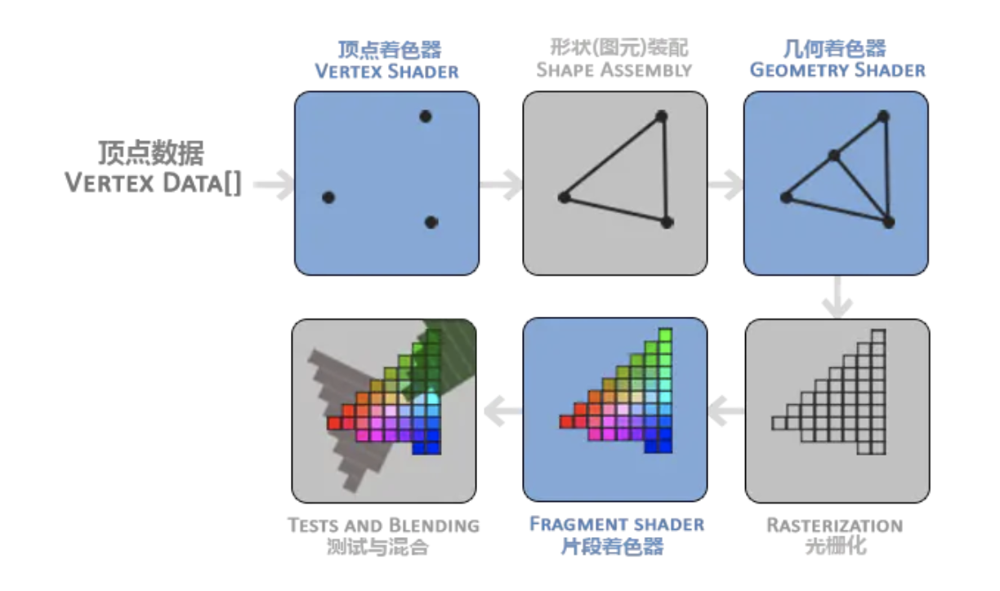

## iOS的渲染流程

iOS的页面渲染：CPU和GPU共同完成


### GPU
GPU是显卡的核心，主要负责图像运算工作，具有高并行运算能力，通过计算将图像显示在像素之中

#### GPU的工作原理
将3D坐标转化为2D坐标，然后将2D的坐标转化为有颜色的像素

#### GPU的工作流程


1. 顶点着色器

2. 形状装配

3. 几何着色器

4. 光栅化

5. 片段着色器（丢弃超出视图以外所有像素点）

6. 测试和混合： 一是检测该像素的深度值zindex，判断是在其他图层前面还是后面，决定是否需要丢弃。二是检测alpha值，判断是否需要图层混合

## iOS渲染相关的框架

// CPU
* UIKit： 日常开发所依赖的UI框架，UIView本身不拥有屏幕成像的能力，其持有CALayer对象才是真正拥有图像展示能力。UIView继承于UIresponder，可以响应用户交互事件
* CoreAnimation：核心动画，是一个复合引擎，尽可能快速的组合屏幕上不同的可视内容。分解成独立的图层（CALayer），存储在图层树中。
* Core Graphic：基于 Quartz 高级绘图引擎，主要用于运行时绘制图像。
* Core Image：运行前图像绘制，对已存在的图像进行高效处理。

// GPU
* OpenGL ES: 由GPU厂商定制实现，可通过C/C++编程操控GPU。
* Metal：由苹果公司实现，WWDC-2018已经推出Metal2，渲染性能比OpenGL ES高。为了解决OpenGL ES不能充分发挥苹果芯片优势的问题

## iOS 原生渲染流程

1. 更新视图树和图层树
2. CPU计算下一帧要显示的内容（创建对象、布局计算、视图绘制和图片解码），CA在runloop注册了observer，在runloop的beforewaiting & exit之前是会调用回调函数，在回调函数中，CA引擎对图层进行encode打包，将打包后的layer tree的数据发送给独立渲染进程render server，这一过程称之为commit transaction的过程
（在这一步中四个都是可以在优化层面提高app列表的流畅程度）
3. render server拿到图层树数据之后进行decode，然后按照图层树的图层顺序、frame、rgb值来过滤图层中被遮挡的部分，生成渲染树，最后将渲染树信息给OpenGL ES/Metal
4. render server调用GPU进行前面提到的6个阶段，生成一帧图像数据（像素数据）， gpu接受计算的纹理，进行上述过程渲染
5. 将显示数据存入帧缓存区（frame buffer），iOS是采用了双缓存区的，显示器按照60FPS的Vsync的信号去frame buffer取屏幕图像，将其显示在屏幕上

## UI优化

### 为什么会出现掉帧（fps低于40就会感觉到明显的卡顿）
由于iOS的双缓存（frame buffer）和默认开启了GPU的垂直同步V-Sync，在1/60(一个V-Sync垂直同步信号时间)内CPU和GPU未完成渲染数据计算和内容提交，那么这一帧将会给丢弃，等待下一次V-sync信号的显示，再次之前会保留之前的显示内容不变，这就是卡顿的来源

### 优化层面分CPU和GPU两个维度

#### CPU相关的渲染优化
1. 对象创建：对象的创建会涉及内存分配，调整属性甚至是文件IO
对于无交互的UI可以使用CALayer实现， storyboard尽量避免使用还有就是对象复用池

2. 对象调整：CALayer的属性都是在resolveInstanceMethod动态解析阶段为对象临时添加的方法，存在内部的一个Dic内， 同时还会通知 delegate、创建动画等等，非常消耗资源。UIView 的关于显示相关的属性（比如 frame/bounds/transform）等实际上都是 CALayer 属性映射来的，所以对 UIView 的这些属性进行调整时，消耗的资源要远大于一般的属性。对此你在应用中，应该尽量减少不必要的属性修改。
不要频繁更改视图层级关系，添加和移除视图（可以在CA的一次Commit Transaction里面更改到位）

3. 对象销毁：对象销毁特别注意的是容器持有大量对象的话，其资源销毁时的资源消耗是非常明显的，所以对这类对象的释放可以放到后台线程里面
Tip：把持有大量对象的容器变量捕捉到block中，然后扔到后台队列去随便发送个消息以避免编译器警告，就可以让对象在后台线程销毁了
``` C
NSArray *tmp = self.array;
self.array = nil;
dispatch_async(bgQueue, {
  [tmp class];
});
```
4. AutoLayout: 随着视图的增长，autolayout带来的CPU的消耗是指数级上涨，所以比较好的布局解决方案是Screen适配方案+top/bottom这类工具函数的解决方案
5. 文本计算：后台计算后存入cache
6. 文本渲染：异步渲染和TextKit+CoreText CT的对象内存占用很少，可以缓存下来多次复用渲染
7. 图像解码：异步解码， SDWebImage这类的网络库都是实现的
8. 图像绘制：CoreGraphic的方法通常识线程安全的，所以可以参考YYAsyncLayer进行异步绘制

#### GPU相关的优化

1. 纹理的渲染：需要绘制的bitmap（图片，文本和栅格化的内容）最后都是由render server 从内存提交显存的，让后绑定GPU的Texture，这个过程都是需要消耗许多GPU资源。当短时间内显示大量图片，GPU的压力会更大，可以通过图片合成一张进行显示。
还有当bitmap的尺寸超过GPU能绘制的最大纹理尺寸，需要CPU进行预处理，这对CPU和GPU都会带来额外的消耗。

2. 图层的混合：image的alpha通道，视图的透明度，可以通过instrument的Core Animation工具

3. 图形的绘制：圆角，阴影和mask的处理，减少off-screen render

#### YY和SY在渲染优化的实践

1. 预排版

2. 预渲染

3. 异步绘制：快速判断绘制是否已经被取消
还有不是复杂的异步绘制，可以计算松开手指后计算滑动停止的cell，预先绘制那个位置附近的几个cell，忽略滑动过程中的cell，会留下空白

4. 全局并发控制，大量任务提交后台的话会有线程爆炸的问题，解决方式是维护和cpu核心数相同的线程池

5. 显示简单的单张，设置UIView.layer.contents

6. pre-composing, runloop调度UI任务


## iOS中的图片
