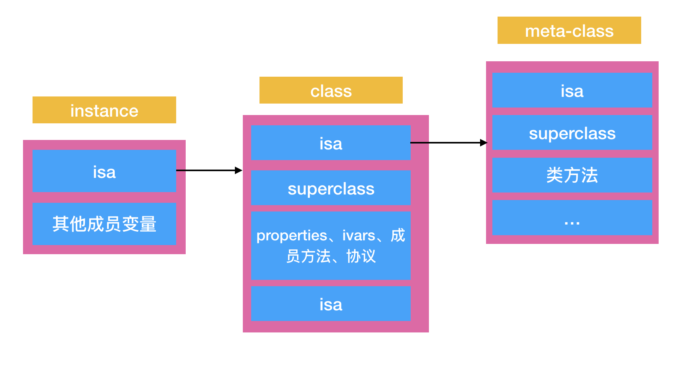

## 内存的相关概念

### 内存分类
* Clean Memory: 在闪存中有备份，可以再次从闪存中读取, 主要包括system framework、binary executable of your app、 memory mapped files
* Dirty Memory: 所有非clean memory， 系统无法回收，包括：heap allocation、caches、decompressed images

### 内存之间的关系
* 虚拟内存： Virtual Memory = Clean Memory + Dirty Memory
* 物理内存： Resident Memory = Dirty Memory + Clean memory that loaded in phisical memory
* 总结 vm = dm + cm > rm > dm

系统由于内存占用过大出现abort的话，需要关注的是物理常驻内存resident memory, 特别是随着程序进行加载到物理内存的dirty memory的增长


### 虚拟内存VM

物理内存就是值硬件的RAM，在实际程序的运行过程中，整个程序是不需要整个加载到物理内存中的，mach-o文件的page section和page fault，

``` C
// clean memory
char *buf = malloc(100 * 1024 * 1024)

// dirty memory
for (i = 0; i < 3*1024*1024; i++) {
  buf[i] = rand()
}
```
* 向系统申请了100M的内存，但是只要你不用我就不会给你在物理内存上分配
* 当我们在for中进行写的操作，这时候系统给你分配3M的物理内存，其他的97M是虚拟内存
* 所以VM的使用是为了不受物理内存的限制

### Allocations分析
All heap & Anoymous VM: 虚拟内存
Dirty Size: dirty memory
Resisdent Size: 物理内存

### 虚拟地址 向 物理地址的转换

我们程序访问的都是逻辑地址空间（虚拟地址），逻辑地址需要通过转化之后才能访问到物理内存地址：

* 通过两个寄存器： 1. 界限寄存器判断是否地址越界 2. 基址寄存器的值 + 虚拟地址 -> 物理内存地址


### 为什么桌面App很少因为内存搞给Kill掉，移动设备则会因为内存占用过大而Abort

桌面OS的Swap机制：物理内存紧张的时候将挂起的进程暂时swap到磁盘，腾出物理内存空间给新的进程，相当于使用磁盘来拓展了物理内存


移动端的闪存读写次数会影响寿命，所以没有swap机制，对于iOS来说，当内存紧张，kill掉优先级低的进程

### iOS 中的内存管理方式

#### iOS App运行时进程的分布



1. 进程加载器 将mach-o文件加载虚拟内存中（虚拟内存够大，所以会加载所有的clean memory）， 但是APP启动后虚拟内存加载到真正的物理内存的时候不是全部加载（iOS中的内存管理方式是全功能的，段式和页式，头条通过编译的分页重排减少启动时的page fault优化启动时间）
2. mach-o文件的header，里面记录了各个segment的信息（VM偏移，VM地址和大小）进程加载器根据header的信息将各个段加载到物理内存中
  * 代码段
  * 数据段： 全局静态区（全局变量和静态变量）
  * BSS段：未初始的变量
3. head向高位扩散，stack低位扩散，辩证两者之间有足够的VM内存空间分配

#### iOS的内存管理

* iOS的采用的全功能的内存管理方式：段式和页式
* 在内存优化中我们侧重优化对应的是 dirty memory loaded in phisical memory
  1. heap创建的对象（这是我们实际了开发中直接）
  2. 闪存中加载的images：本身加载的图片可能不大，但是在添加到layer.content之前的decode后的大小有像素大小决定
  网络图片，SD在download之后，为了性能会在内存中保留decode后的图片
  3. 保存在内存中的cache
* App层使用Malloc Region来管理VM
* kernal层则是使用VM Object对象来管理虚拟内存和物理内存之间的map

### iOS中低内存处理机制 jetsam

OS 维护了一个优先级队列，从上往下， 优先级递增

* IDLE： 闲置进程
* UI SUPPORT：后台进程（热启动）
* FORGEROUND：运行在前台的进程
* HOME：SpringBoard

1. 当系统内存过低的时候，OS将会去广播内存消息，通知大家释放内存，在设定的时间阈值之后，会按照队列优先级去kill进程
2. UIKit 提供了一下回调和通知去处理低内存
```
[UIApplicationDelegate applicationDidReceiveMemoryWarning:]
[UIViewController didReceiveMemoryWarning:]
/*可以处理单例中大内存对象，持有的大数据image和data的释放*/
UIApplicationDidReceiveMemoryWarningNotification
/*SDWebImage清除缓存，CacheManager清除缓存*/
```

### 内存优化
#### Strong Weak Dance 解决闭包的内存泄漏和提前释放
先将strong修饰的强引用对象转为weak的弱引用，防止block对象之间的循环引用，防止内存泄漏
在block中将weakSelf的弱引用转化为强引用，防止在多线程和ARC下弱引用随时释放的问题

#### 延迟加载，减少内存峰值
懒加载

#### 图片的读取
```
UIImage(named: name)          // 带缓存(decoded后的缓存吗？)
UIImgae(contentOfFile: path)  // 大文件，不会常驻内存缓存
```

#### NSData & MMAP
```
public init(contentsOfFile path: String, options readOptionsMask: NSDataReadingOptions)
```
创建了一个内存映射文件，把内容放在虚拟内存中，只有读取操作才会读取相应页到内存页中

#### 其余高端方法
* calloc VS malloc + memset
* 栈内存分配

#### AutoReleasePool

* MRC时代，使用AutoReleasePool来管理对象的释放，main函数在OC项目里面在主线程的runloop启动的时候创建一个，在每次runloop的beforeWaiting | exit的时候统一进行对象的引用计数-1操作
* ARC时代使用autorealease降低内存峰值
``` swift
for i in 1...10000 {
  autorealeasepool {
    let data = NSData.dataWithContentOFFile(path)
  }
}
// 当data大的时候，每次迭代的时候释放掉上次的对象，如果不这么优化的话，data对象会堆积，在runloop的注册的handler函数才会处理
```

#### 收到内存警告处理
* 尽可能清除图片和cache，在需要的时候重新构建
* 减少单例的使用，特别是持有大内存对象的单例

### autoreleasepool的原理 

### mmap的原理


