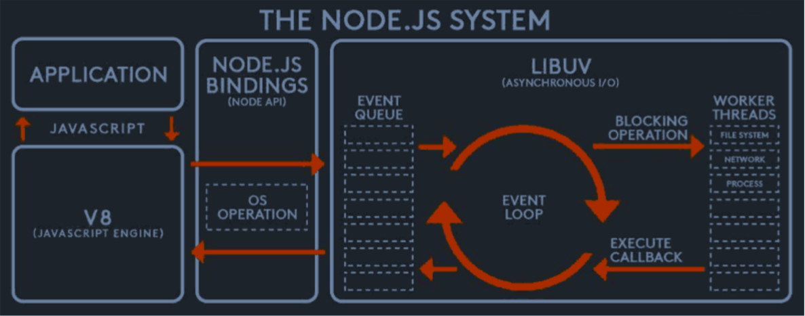
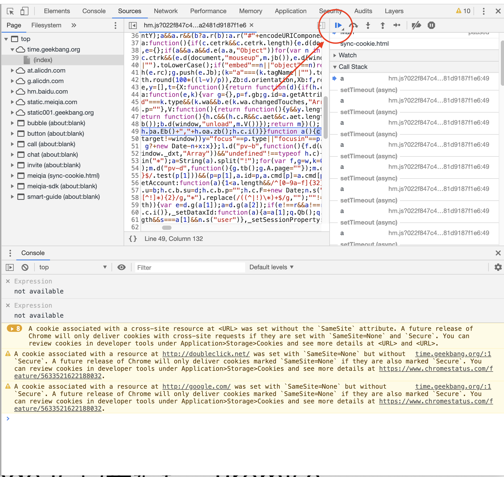
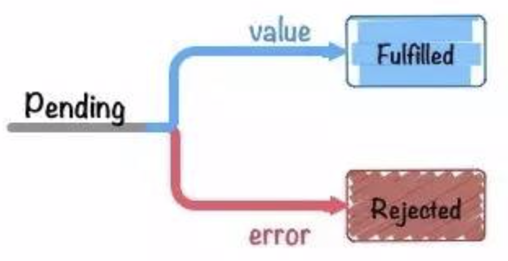

## 异步：非阻塞I/O

### 非阻塞I/O定义
* I/O 即Input/Output, 一个系统的输入和输出
* 阻塞I/O和阻塞I/O的区别在于系统接收输入再到输出期间，能不能接收其他输入

### Node架构设计



* 系统边界：左边和LibUV（event queue + event loop）在一个node线程里面
* 其他c++工作线程
* node将任务分发给其他线程

## 异步：异步编程之callback

### Node回调函数格式规范

* error-first callback
* Node-style callback

所有callback函数都要遵循一个参数格式：第一个参数是error， 后面的参数才是结果

### 为什么需要遵循error-first范式
``` js
try {
  interview(function() {
    console.log('smile');
  })
} catch (e) {
  console.log('cry', e);
}

function interview(callback) {
  setTimeout(() => {
    if (Math.random() < 0.1) {
      callback('success')
    } else {
      throw new Error('fail')
    }
  }, 500);
}
```

* try-catch机制：try-catch是根据当前函数调用栈从栈顶往下抛的，throw 抛出的错误从栈顶往下寻找try-catch(被try-catch包裹)，如果throw的error没有被catch，就会抛到全局，node.js程序会崩溃
* 为什么上面的error会被抛到全局（throw 是在interview函数里面，被trycatch包裹的）：是因为事件循环，node里面每一个事件循环都是一个全新的调用栈，throw error是在setTimeOut函数里面，是在另一个事件循环被回调的，所以这里的try-catch是不能捕获到抛出的error的，被抛到了node.js全局的
* node回调规范： 第一个参数不为空，代表这次非阻塞I/O(异步任务调用)失败了

``` js node.js 回调规范
interview(function(res) {
  if (res instanceof Error) {
    return console.log('cry');
  }
  console.log('smile');
})

function interview(callback) {
  setTimeout(() => {
    if (Math.random() < 0.8) {
      ** 错误的时候，cb的第一个参数为null **
      callback(null, 'success')
    } else {
      callback(new Error('fail')) 
    }
  }, 500);
}
```

### 回调函数的异步流程控制的问题：回调地狱
* 异步串行控制：回调地狱
* 异步并发控制：计数器判断代码（冗余代码）

``` js 异步串行调用 callback hell
 interview(function(err) {
  if (err) {
    return console.log('cry at 1st round');
  }
  
  interview(function(err) {
    if (err) {
      return console.log('cry at 2st round');
    }

    interview(function (err) {
      if (err) {
        return console.log('cry at 3st round');
      }

      console.log('smile');
    })
  })
})
```

``` js 异步并行调用
var count = 0
interview(function(err) {
  if (err) {
    return console.log('cry')
  }
  count ++

  if (count === 2) {
    console.log('smile')
  }
})

interview(function(err) {
  if (err) {
    return console.log('cry')
  }
  count++
  if (count === 2) {
    console.log('smile')
  }
})

function interview(callback) {
  setTimeout(() => {
    if (Math.random() < 0.8) {
      callback(null, 'success')
    } else {
      callback(new Error('fail'))
    }
  }, 500);
}
```
* 之前在永辉写iOS的方式就是这样的并行调用处理，代码看起来好丑
* TODO: 后面可以在iOS里面看下异步流程控制的解决方案：阿里的coroutine框架coobjc

npm社区的解决方案：
* async.js(思路可以参考下)
* thunk 编程范式

## 异步：事件循环

事件循环是非阻塞I/O的基础
``` js
// eventloop 示例代码
const eventloop = {
  queue: [],        // 事件队列
  timeoutqueue:[],  // 延时队列
  fsqueue: [],      // 文件队列

  loop() {
    while (this.queue.length) {
      var callback = this.queue.shift()
      callback()
    }
    
    this.fsqueue.forEach(callback => {
      if (done) {
        callback()
      }
    })

    this.timeoutqueue.forEach(callback => {
      if (done) {
        callback()
      }
    })

    setTimeout(this.loop.bind(this), 50);
  },
  
  add(callback) {
    this.queue.push(callback)
  }
}

eventloop.loop()

setTimeout(() => {
  eventloop.add(
    function() {
      console.log(1)
    }
  )
}, 500);

setTimeout(() => {
  eventloop.add(
    function () {
      console.log(2)
    }
  )
}, 500);
```

### 理解：每一个事件循环都是一个全新的函数调用栈

chrome debug查看函数调用栈


* 栈底部的函数由谁触发的：在node.js中底部函数是eventloop触发的一个时间，就是上面代码执行的callback
* 这个callback就是调用栈的底部，在这个callback之前执行的都是c++代码，在callback之后的调用才是我们的js代码

``` js
function interview(callback) {
  setTimeout(() => {
    if (Math.random() < 0.8) {
      callback(null, 'success')
    } else {
      // throw new Error('fail')
      callback(new Error('fail'))
    }
  }, 500);
}
```

理解：为什么上面的 throw new Error('fail') 会将错误抛到全局
* settimeout就是把回调函数foo提交到eventloop里面，形成一个eventloop里面的timeout事件
* 500ms之后，eventloop检查到需要调用foo这个回调函数
* 调用foo，形成一个新的函数调用栈，foo在调用栈底部，没有trycatch可以捕获throw的error，所以error被抛到了全局

* interview这个函数和setTitmeout的回调函数看着写在一起，但是完全不在一个调用栈里面（遥远距离）

## 异步：异步编程之Promise

* Promise
  * 在当前的**事件循环**得不到结果，但未来的**事件循环**会给到你结果
  * 是一个状态机
    * pending 状态未定
    * fulfilled/resolved 正确状态
    * rejected 错误状态


``` js
(function(){
  var promise = new Promise((resolve, reject) => {
    setTimeout(_ => {
      resolve()
      reject(new Error())
    }, 500)
  })
  
  console.log(promise)

  setTimeout(() => {
    console.log(promise)
  }, 800)
})()
```
将上面代码粘贴到开发者模式下的chrome执行，可以打印出promise的状态
``` js
Uncaught (in promise) Error
    at <anonymous>:4:14
(anonymous) @ VM56:4
setTimeout (async)
(anonymous) @ VM56:3
(anonymous) @ VM56:2
(anonymous) @ VM56:13
```
reject的error 如果没有catch的话，错误会被抛向全局

### resolve 和 reject 的状态无法互相转换
``` js
(function() {
  var promise = new Promise((resolve, reject) => {
    setTimeout(() => {
      resolve()
    }, 300)
    setTimeout(() => {
      reject()
    }, 500)
  })

  console.log(promise)

  setTimeout(() => {
    console.log(promise)
  }, 800)
})()
```
console的打印：
Promise {<pending>}
Promise {<resolved>: undefined} resolve状态不能转换到reject状态

.then 和 .catch
* resolved状态的Promise会回调后面的第一个.then
* rejected状态的Promise会回调后面的第一个.catch
* 任何一个rejected状态后面没有.catch的Promise，都会造成浏览器/node环境的全局错误

### .then .catch 执行之后返回新的Promise(解决异步流程控制的基础)
``` js 
// return or throw
(function() {
  var promise = interview()
  var promise2 = promise
    .then((res) => {
      // return 'accept'        // promise2 resolved
      throw new Error('refuse') // promise2 rejected
    })
    // .catch((e) => {
    //   return 'accept'
    // })

  setTimeout(() => {
    console.log(promise);
    console.log(promise2)
  }, 800);
})();

function interview() {
  return new Promise((resolve, reject) => {
    setTimeout(_ => {
      if (Math.random() > 0) {
        resolve('success')
      } else {
        reject(new Error('fail'))
      }
    }, 500)
  })
}
```

``` js
// 返回Promise
(function() {
  var promise = interview();
  var promise2 = promise
    .then(res => {
      return new Promise(function(resolve, reject) {
        setTimeout(() => {
          resolve('accept')
        }, 400);
      })
    });

  setTimeout(() => {
    console.log(promise);
    console.log(promise2);
  }, 800);
  setTimeout(() => {
    console.log(promise);
    console.log(promise2);
  }, 1000);
})();

function interview() {
  return new Promise((resolve, reject) => {
    setTimeout(_ => {
      if (Math.random() > 0) {
        resolve('success')
      } else {
        reject(new Error('fail'))
      }
    }, 500)
  })
}

输出结果：
Promise {<resolved>: "success"}
VM89:14 Promise {<pending>}
VM89:17 Promise {<resolved>: "success"}
VM89:18 Promise {<resolved>: "accept"}
```


总结：执行then和catch会返回一个新的Promise，该Promise最终状态根据then和catch的回调函数的执行结果决定
* 如果回调函数最终是throw，该Promise是rejected状态
* 如果回调函数最终是throw，该Promise是resolved状态
* 如果回调函数最终return了一个Promise，该Promise回和回调函数return的Promise状态保持一致（因此可以在Promise的链式调用串行的执行多个异步任务）

### Promise如何解决异步编程流程控制问题（串行和并行）

``` 串行异步
(function() {
  var promise = interview(1)
    .then(() => {
      return interview(2)
    })
    .then(() => {
      return interview(3)
    })
    .then(() => {
      console.log('smile');
    })
    .catch((e) => {
      console.log('cry at ' + e.round + ' round');
    })
})();

function interview(round) {
  return new Promise((resolve, reject) => {
    setTimeout(_ => {
      if (Math.random() > 0.2) {
        resolve("success");
      } else {
        var error = new Error('fail')
        error.round = round
        reject(error);
      }
    }, 500);
  });
}
```
* 这样用Promise重构了串行异步的代码，代码看起来更加线性了，可维护行增强

``` js
// 并发异步
(function() {
  Promise
    .all([
      interview('ali'),
      interview('tecent')
    ])
    .then(_ => {
      console.log('smile');
    })
    .catch(e => {
      // 捕获第一个rejected的Promise
      console.log('cry for ' + e.name);
    })
})();
// 如果要知道所有并发的promise状态，只能先存下来
// var promise1 = new Promise(function(resolve, reject) {});
// var promise2 = new Promise(function(resolve, reject) {});

function interview(name) {
  return new Promise((resolve, reject) => {
    setTimeout(_ => {
      if (Math.random() > 0.2) {
        resolve("success");
      } else {
        var error = new Error('fail')
        error.name = name
        reject(error);
      }
    }, 500);
  });
}
```

## 异步：异步编程者async/await（异步编程的终极解决方案）

### AsysnFunction
``` js
console.log(async function() {

});

console.log(function() {
  return new Promise(resolve => {
    resolve(4)
  })
})
// 输出
[AsyncFunction]
[Function]
```

``` js
console.log(async function() {
  // return 4
  throw new Error('4)
}());

console.log(function() {
  return new Promise((resolve, reject) => {
    // resolve(4)
    reject(new Error('4'))
  })
}())
// 输出
Promise { 4 }
Promise { 4 }
```

async/await
* async function就是Promise语法糖封装(AsynFunction就是返回Promise的普通函数)
* 异步编程的终极解决方案--以同步的方式写异步
  * await关键字可以“暂停”async function的执行
  * await可以以同步的写法获取Promise的执行结果
  * try-catch 可以获取await所得到的错误（即便是另一个函数调用栈抛出的？=> 研究完v8对async/await的底层支持再来看）

``` js
(function() {
  const result = async function () {
    var content = new Promise((resolve, reject) => {
      setTimeout(() => {
        resolve()
      }, 500)
    })

    console.log(content)
    return 4
  }()
  setTimeout(() => {
    console.log(result);
  }, 800)
})()
VM115:9 Promise {<pending>}
undefined
VM115:13 Promise {<resolved>: 4}
```
``` js
//  await 等待Promise的执行结果
(function() {
  const result = async function () {
    var content = await new Promise((resolve, reject) => {
      setTimeout(() => {
        resolve(6)
      }, 500)
    })

    console.log(content)
    return 4
  }()
  setTimeout(() => {
    console.log(result);
  }, 800)
})()
undefined
VM133:9 6
VM133:13 Promise {<resolved>: 4}
```
``` js
// 使用await关键字，Promise抛出的错误是可以被trycatch捕获的
(function() {
  const result = async function () {
    try {
      var content = await new Promise((resolve, reject) => {
        setTimeout(() => {
          reject(new Error('8'))
        }, 500)
      })
    } catch (error) {
      console.log('error', error.message)
    }

    console.log(content)
    return 4
  }()
  setTimeout(() => {
    console.log(result);
  }, 800)
})()
```

### 解决异步编程编程
``` js
// 串行控制
(async function() {
    try {
      await interview(1)
      await interview(2)
      await interview(3)
    } catch (e) {
      return console.log('cry at'  + e.round);
      
    }
})();

function interview(round) {
  return new Promise((resolve, reject) => {
    setTimeout(() => {
      if (Math.random() > 0.2) {
        resolve('success')
      } else {
        reject(new Error('fail'))
      }
    }, 500);
  })
}
```

``` js
// 并发控制
(async function() {
    try {
      // await 后面可以跟任何Promise的, 可以返回一个Promise对象
      await Promise.all([
        interview(1)
        interview(2)
      ])
    } catch (e) {
      return console.log('cry at'  + e.round);
    }
})();

function interview(round) {
  return new Promise((resolve, reject) => {
    setTimeout(() => {
      if (Math.random() > 0.2) {
        resolve('success')
      } else {
        reject(new Error('fail'))
      }
    }, 500);
  })
}
```

* 总结：async/await 一个穿越事件循环的function

## TODO
* 仔细研究下v8对js异步编程的实现和支持，底层是如何用微任务和coroutine、generator支持js的异步编程语法的 
* flutter里面的dart的异步编程和这个是一样的，Future async/await


